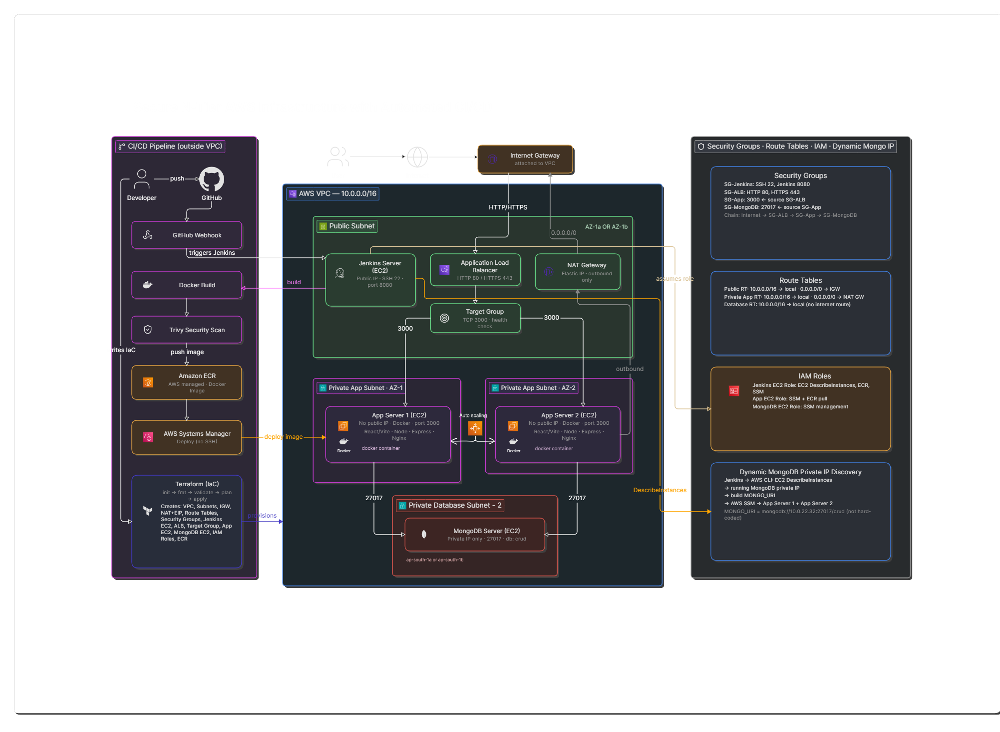

# End-to-End Automated & Secure n-Tier Cloud Infrastructure with Application Deployment


A secure, scalable, and automated **n-Tier application infrastructure** deployed on AWS using **Terraform, Docker, Jenkins, GitHub, Amazon ECR, Trivy, AWS Systems Manager, and MongoDB**.

This project demonstrates Infrastructure as Code, secure network segmentation, containerization, CI/CD automation, container vulnerability scanning, dynamic database configuration, and automated application deployment on AWS.

---

## Project Description / Overview

This project demonstrates an end-to-end automated and secure n-tier application infrastructure deployed on AWS.

The infrastructure is provisioned using **Terraform** and the application is containerized using **Docker**. **Jenkins** automates the CI/CD pipeline, while **Trivy** scans Docker images for vulnerabilities before deployment.

The application runs on private EC2 application servers behind an **Application Load Balancer (ALB)**, with **MongoDB** hosted in a private database subnet.

AWS Systems Manager (SSM) is used to deploy and manage the private application servers without requiring direct public SSH access.

### Key Objectives

- Build a secure n-tier AWS architecture
- Provision infrastructure using Terraform
- Containerize the application using Docker
- Automate CI/CD using Jenkins and GitHub
- Scan container images using Trivy
- Store images in Amazon ECR
- Deploy to private EC2 servers using AWS Systems Manager
- Keep application and database servers in private subnets
## Quick Links

- [Architecture Documentation](docs/architecture.md)
- [Deployment Guide](docs/deployment.md)
- [Security Documentation](docs/security.md)
- [Jenkins Pipeline](Jenkins/Jenkinsfile)
- [Terraform Configuration](terraform/)

---

## Architecture Diagram

The following diagram represents the complete AWS infrastructure, application traffic flow, CI/CD pipeline, and private network architecture.

<p align="center">
  
</p>

---
## Architecture Components

| Component | Purpose |
|---|---|
| AWS VPC | Provides an isolated network environment |
| Public Subnet | Hosts Jenkins, ALB, and NAT Gateway |
| Private App Subnet | Hosts the application servers |
| Private DB Subnet | Hosts the MongoDB server |
| Internet Gateway | Provides internet connectivity for the VPC |
| NAT Gateway | Provides outbound internet access for private servers |
| Application Load Balancer | Distributes incoming application traffic |
| Target Group | Routes traffic to application servers |
| Jenkins | Automates the CI/CD pipeline |
| Amazon ECR | Stores Docker container images |
| Trivy | Scans container images for vulnerabilities |
| AWS Systems Manager | Manages and deploys private EC2 servers |
| EC2 | Hosts Jenkins, application, and MongoDB servers |
| MongoDB | Stores application data |


## Application Flow

Application traffic follows this path:

```text
User
  ↓
Internet
  ↓
Internet Gateway
  ↓
Application Load Balancer
  ↓
Target Group
  ↓
App Server 1 / App Server 2
  ↓
MongoDB
```

The ALB distributes incoming requests across the private application servers registered in the target group.

Private application servers use the NAT Gateway for outbound internet connectivity.

---


## Technology Stack

| Category                | Technologies                              |
| ----------------------- | ----------------------------------------- |
| Cloud                   | AWS                                       |
| Infrastructure as Code  | Terraform                                 |
| Compute                 | Amazon EC2                                |
| Networking              | VPC, Subnets, Route Tables                |
| Connectivity            | Internet Gateway, NAT Gateway, Elastic IP |
| Load Balancing          | Application Load Balancer, Target Groups  |
| Security                | IAM, Security Groups, Trivy               |
| Containers              | Docker, Docker Compose                    |
| Container Registry      | Amazon ECR                                |
| CI/CD                   | Jenkins                                   |
| Version Control         | Git, GitHub                               |
| Server Operating System | Amazon Linux 2023                         |
| Server Management       | AWS Systems Manager, Session Manager      |
| Web Server              | Nginx                                     |
| Frontend                | React, Vite                               |
| Backend                 | Node.js, Express.js                       |
| Database                | MongoDB                                   |
| Scripting               | Bash, Linux                               |
| Server Access           | SSH                                       |
| Command-Line Tools      | AWS CLI                                   |

---

## Project Structure

```text
secure-n-tier-infra/
│
├── application/
│   ├── client/
│   └── server/
│
├── Docker/
│   ├── .dockerignore
│   ├── docker-compose.yml
│   ├── Dockerfile
│   ├── nginx.conf
│   └── supervisord.conf
│
├── docs/
│   ├── images/
│   │   ├── architecture-diagram.png
│   │   ├── Infra/
│   │   ├── Jenkins/
│   │   └── other/
│   │
│   ├── architecture.md
│   ├── deployment.md
│   └── security.md
│
├── Jenkins/
│   └── Jenkinsfile
│
├── scripts/
│   ├── Health-check.sh
│   └── install-terraform.sh
│
├── terraform/
│   ├── modules/
│   │   ├── alb/
│   │   ├── ec2/
│   │   ├── ecr/
│   │   ├── security-group/
│   │   └── vpc/
│   │
│   ├── data.tf
│   ├── locals.tf
│   ├── main.tf
│   ├── outputs.tf
│   ├── providers.tf
│   ├── README.md
│   ├── terraform.tfvars.example
│   ├── variables.tf
│   └── versions.tf
│
├── .gitignore
└── README.md
```

> Terraform state files, the `.terraform` directory, credentials, private keys, and other sensitive files should not be committed to the Git repository.

---


---

## Infrastructure Provisioning

Terraform provisions and manages the following AWS resources:

```text
VPC
Public Subnet
Private Application Subnet
Private Database Subnet
Internet Gateway
NAT Gateway
Elastic IP
Route Tables
Security Groups
Application Load Balancer
Target Groups
EC2 Instances
Amazon ECR
IAM Resources
```

The infrastructure is designed to be repeatable, version-controlled, and consistently deployable across environments.

---

## CI/CD Pipeline

Jenkins automates the application build and deployment lifecycle.

Pipeline flow:

```text
GitHub
   ↓
Jenkins
   ↓
Docker Build
   ↓
Trivy Security Scan
   ↓
Amazon ECR Login
   ↓
Push Image to ECR
   ↓
Dynamic MongoDB IP Discovery
   ↓
AWS Systems Manager Deployment
   ↓
Private App Servers
   ↓
Application Health Check
```

The pipeline ensures that container images are scanned before deployment and that the latest approved image is deployed to the private application servers.

---

---

## Security

Security is implemented through:

* Public and private subnet separation
* Security Groups with restricted traffic rules
* IAM-based access control
* Private application servers
* Private MongoDB server
* Application Load Balancer as the public entry point
* Trivy container vulnerability scanning
* Amazon ECR for private image storage
* AWS Systems Manager for private server management
* Controlled database access from the application tier

See the detailed security documentation:

```text
docs/security.md
```

---
## Documentation

Detailed project documentation is available in the `docs/` directory.

- [Architecture Documentation](docs/architecture.md)  
  Details about the AWS n-Tier architecture, network design, components, and traffic flow.

- [Deployment Documentation](docs/deployment.md)  
  Step-by-step guide for Terraform infrastructure provisioning, Jenkins CI/CD, Docker image build, ECR push, and application deployment.

- [Security Documentation](docs/security.md)  
  Details about private subnets, Security Groups, AWS Systems Manager, IAM, Trivy security scanning, and secure access.

- [Architecture Diagram](docs/images/architecture-diagram.png)  
  Visual representation of the complete AWS infrastructure and application flow.

---

## Health Check

The project includes an application health-check script:

```text
scripts/Health-check.sh
```

Make the script executable:

```bash
chmod +x scripts/Health-check.sh
```

Run the health check:

```bash
./scripts/Health-check.sh
```

The script can be used to verify application availability and deployment status.

---

## Key Features

* Secure AWS n-Tier architecture
* Dedicated public, application, and database network tiers
* Private application and database servers
* Two application servers for improved availability
* Application Load Balancer with target-group routing
* Dockerized application deployment
* Terraform-based infrastructure provisioning
* Jenkins-based CI/CD automation
* GitHub webhook integration
* Trivy container image vulnerability scanning
* Amazon ECR image storage
* Dynamic MongoDB private IP discovery
* AWS Systems Manager-based deployment
* Automated application health checks
* Controlled network access using Security Groups and IAM


## 👨‍💻 Author

**Arun Mothe**

Cloud & DevOps Engineer

<p align="left">
  <a href="https://github.com/arunmothe1">
    
  </a>
  <a href="https://github.com/arunmothe1/secure-n-tier-infra">
    
  </a>
</p>

---