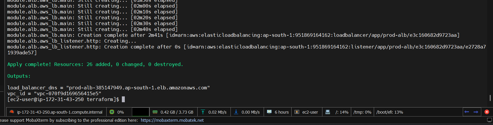
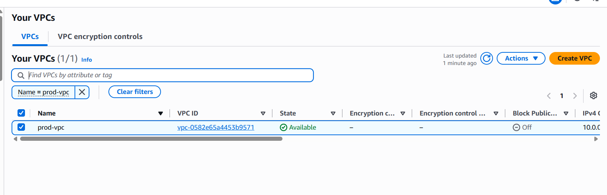
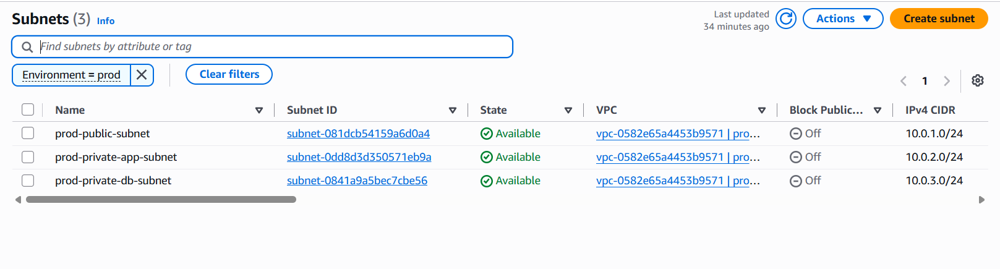
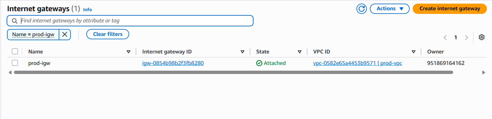
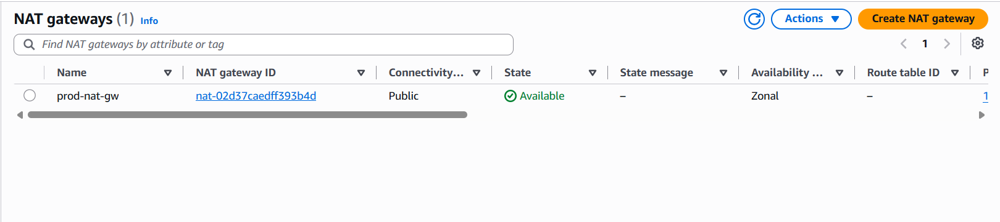
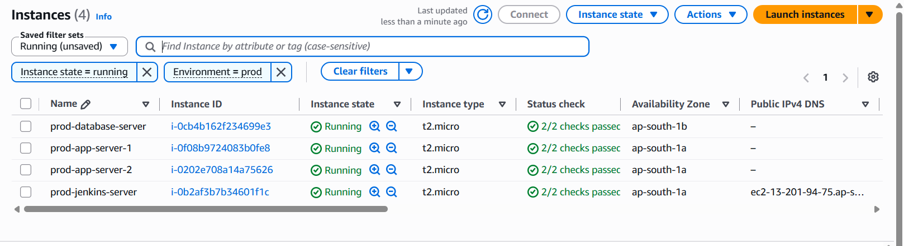
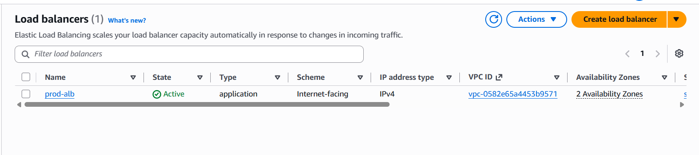

# AWS n-Tier Infrastructure Provisioning with Terraform

This directory contains production-grade Infrastructure as Code (IaC) written in **Terraform** to provision a highly secure, scalable, and modular **n-Tier Cloud Architecture** on AWS.

---

## 🏗️ Architecture Overview

The infrastructure creates an isolated multi-tier environment spanning across Public and Private subnets using Amazon Linux 2023 instances:

1. **Networking Tier (VPC)**:
   - 1 Public Subnet (Host for Jenkins Control Server, NAT Gateway, ALB)
   - 1 Private Subnet (Application Tier - App Server 1 & 2)
   - 1 Private Subnet (Database Tier - DB Server)
   - Internet Gateway (IGW) for public traffic and NAT Gateway for secure outbound internet connectivity for private subnets.

2. **Security Tier (Security Groups)**:
   - **ALB SG**: Accepts HTTP (Port 80) from `0.0.0.0/0`.
   - **Jenkins SG**: Accepts SSH (Port 22) & Web UI (Port 8080).
   - **App SG**: Accepts HTTP (Port 80) **only** from ALB SG and SSH (Port 22) **only** from Jenkins SG.
   - **DB SG**: Accepts MySQL (Port 3306) **only** from App SG.

3. **Compute Tier (EC2)**:
   - **Jenkins Server**: Managed in Public Subnet.
   - **App Server 1 & 2**: Managed in Private App Subnet running Docker runtime via `user-data`.
   - **DB Server**: Managed in Private DB Subnet.

4. **Load Balancing Tier (ALB)**:
   - Application Load Balancer targeting App Server 1 and App Server 2 with HTTP health checks.

---

## 📁 Directory Structure

```text
terraform/
├── versions.tf               # Terraform core and provider version constraints
├── providers.tf              # AWS Provider configuration & global tags
├── backend.tf                # Remote state configuration (S3 + DynamoDB template)
├── variables.tf              # Global input variables
├── outputs.tf                # Infrastructure output details
├── terraform.tfvars.example  # Sample configuration values
├── networking.tf             # VPC Module Orchestration
├── security-groups.tf        # Security Group Module Orchestration
├── compute.tf                # EC2 Compute Module Orchestration
├── load-balancer.tf          # ALB Module Orchestration
│
├── user-data/
│   ├── bootstrap.sh          # Jenkins server startup script (Amazon Linux 2023)
│   └── app-server.sh         # App servers startup script (Docker setup)
│
└── modules/
    ├── vpc/                  # Reusable VPC module
    ├── security-group/       # Reusable Security Group module
    ├── ec2/                  # Reusable EC2 module (Amazon Linux 2023)
    └── alb/                  # Reusable ALB module
```

---

## ⚙️ Prerequisites

Before running Terraform commands, ensure you have:

- **Terraform CLI** (>= v1.5.0) installed.
- **AWS CLI** configured with valid IAM credentials.
- Appropriate AWS IAM permissions for VPC, EC2, Security Groups, and ALB provisioning.

---

## 🚀 Deployment Steps

### Configure AWS CLI
```bash
Because Terraform will run from the Jenkins server, configure AWS access.

aws configure

Enter:

AWS Access Key ID:     YOUR_ACCESS_KEY
AWS Secret Access Key: YOUR_SECRET_KEY
Default region name:  ap-south-1
Default output format: json
```

### 1. Clone the Repository & Navigate to Directory
```bash
git clone [https://github.com/arunmothe1/End-to-End-Automated-Secure-n-Tier-Cloud-Infrastructure-with-Application-Deployment.git](https://github.com/arunmothe1/End-to-End-Automated-Secure-n-Tier-Cloud-Infrastructure-with-Application-Deployment.git)
cd End-to-End-Automated-Secure-n-Tier-Cloud-Infrastructure-with-Application-Deployment/terraform
```

### 2. Set Variable Value (`terraform.tfvars`)
Provide your exact AWS Key Pair name (**without** the `.pem` extension):

```hcl
key_name = "your exact AWS Key Pair name"

### 2. Initialize Terraform Modules & Provider
```bash
terraform init
```

### 3. Review Provisioning Plan
```bash
terraform plan
```

### 4. Deploy Infrastructure
```bash
terraform apply -auto-approve
```

### 5. Access Outputs
After successful deployment, Terraform will output key endpoints:
```text
Outputs:

jenkins_server_public_ip = "x.x.x.x"
load_balancer_dns        = "prod-alb-xxxxxx.ap-south-1.elb.amazonaws.com"
vpc_id                   = "vpc-xxxxxxxxxxxx"
```

---

## 🧹 Cleanup / Destroy

To tear down all resources and avoid unexpected AWS charges:
```bash
terraform destroy -auto-approve
```


## 📸 Infrastructure Verification & Proof of Concept

The following screenshots verify the complete automated deployment and teardown of the AWS n-tier architecture:

### 1. Terraform Deployment Success


---

### 2. AWS Virtual Private Cloud (VPC)


---

### 3. Public & Private Subnets Topology


---

### 4. Internet Gateway & NAT Gateway
| Internet Gateway | NAT Gateway |
| :---: | :---: |
|  |  |

---

### 5. Provisioned EC2 Instances (Jenkins, App-1, App-2, DB)


---

### 6. Application Load Balancer (ALB)


---

### 7. Automated Infrastructure Teardown (`terraform destroy`)
